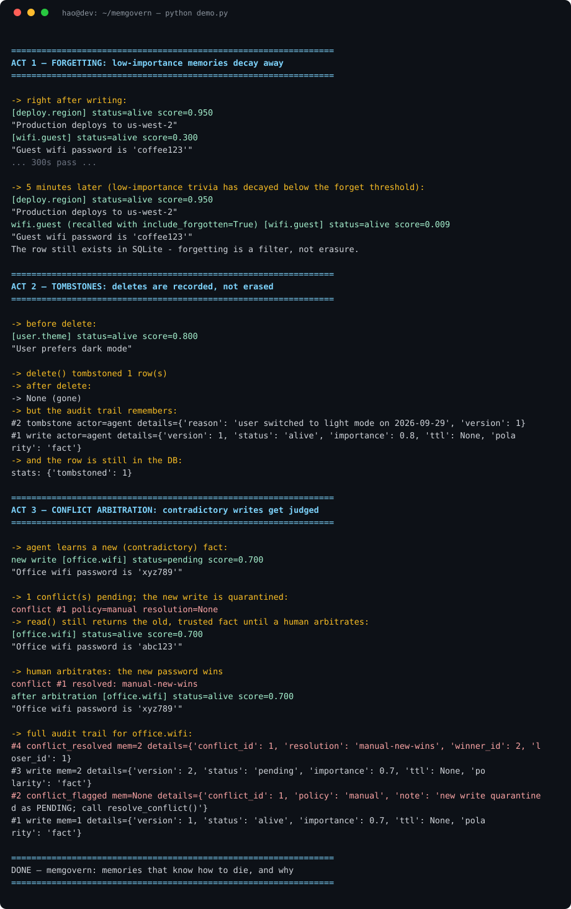

# memgovern

[](LICENSE)
[](pyproject.toml)
[](pyproject.toml)

A tiny memory governance layer for AI agents. Everyone is building the **store and search**
side of agent memory. memgovern does the neglected half: **write and delete** — when a memory
should fade, when it should die, and who wins when two memories disagree.

Zero dependencies. SQLite under the hood. `pip install` and go.



```python
from memgovern import MemoryStore, ConflictPolicy

store = MemoryStore("agent.db", conflict_policy=ConflictPolicy.MANUAL)

store.write("deploy.region", "Production deploys to us-west-2",
            importance=0.95, source="agent", ttl=30*86400)

store.write("user.theme", "User prefers dark mode", importance=0.8)

# later, the agent learns something contradictory:
store.write("user.theme", "User prefers light mode", importance=0.8)
# -> conflict flagged, new write quarantined as PENDING until you arbitrate

store.resolve_conflict(conflict_id=1, winner="new")

# deletion is a tombstone, not an erasure:
store.delete("deploy.region", reason="migrated to eu-central-1")
store.audit(key="deploy.region")  # who wrote what, who deleted what, how conflicts were judged
```

Run the three-act demo (forgetting → tombstones → conflict arbitration):

```
python demo.py
```

## Why this exists

The default failure modes of agent memory are well documented: stale context poisoning,
unreliable writes, no decay, and no rules for deciding which of two contradictory memories
is authoritative. Retrieval keeps getting better; lifecycle management hasn't. memgovern is
the lifecycle half, designed to sit *underneath* whatever store/search layer you already use.

## Core concepts

**Decay & forgetting.** Every memory has an `importance` in [0,1] and a `half_life`.
Its live score is `importance × 0.5^(age / half_life)`. Below `forget_threshold` a memory is
*forgotten*: hidden from `read()`/`query()`, but still in the database (pass
`include_forgotten=True` to recall it). Forgetting is a filter, not erasure — you can
always change your mind about what mattered.

**Tombstones.** `delete()` never physically removes a row. It flips the status to
`tombstoned`, records a reason, and writes to the audit log. `restore()` undoes it.
`purge()` is the only hard delete, and only for tombstoned/superseded rows.

**Conflict arbitration.** Writing a contradictory fact under an existing key triggers the
configured policy:

| Policy | Behavior |
|---|---|
| `overwrite` | Newest wins automatically; the loser becomes `superseded` |
| `manual` | New write is quarantined as `pending`; `read()` keeps returning the old trusted fact until `resolve_conflict(id, winner="new"\|"old")` |
| `keep_both` | Both stay alive; the conflict is recorded in the audit log |

Contradiction detection is deterministic (same key, different text). An opt-in
`also_check_similar=True` flag adds token-overlap hints across keys — logged to audit
only, never auto-arbitrated, because heuristics shouldn't judge.

**Source trust.** Every write records its `source`, and each source carries a
reliability ledger: writes, conflicts won/lost, tombstones, quarantines. Trust is a
Bayesian-smoothed win rate — `(wins + k·prior) / (decided + k)` with `prior = 0.5`,
`k = 4` — so a new source starts exactly neutral and only *decided* arbitrations move
the needle, never raw write volume. Idle scores decay toward the prior with a 30-day
half-life, so a compromised-then-clean source can recover and a long-quiet "trusted"
source quietly loses its halo.

Pass `arbitration="trust"` to `write()` under the `manual` policy and a same-key
contradiction is auto-arbitrated when the trust gap between the two sources exceeds
`trust_threshold` (default 0.25): the higher-trust source wins, the loser is superseded
(never silently deleted), and both scores land in the audit log. Close scores fall back
to quarantine + `resolve_conflict()` as before. `store.source_trust("agent")` and
`store.trust_report()` expose the ledger; `resolve_conflict()` credits the winner's
source with a win.

**Poisoning tripwires.** Three fixed, documented rules run on every write — structural,
no LLM, no network. A hit never auto-accepts: the write is born `pending` (quarantined)
and the reason is audit-logged.

| Tripwire | Fires when |
|---|---|
| `new-source-vs-high-trust` | a source with zero recorded writes contradicts a key held by a source with trust ≥ 0.75 |
| `burst` | one source writes more than 20 times in 60 s (all configurable) |
| `injection-marker:<phrase>` | the text contains a known injection phrase — `ignore previous instructions`, `disregard previous instructions`, `system:`, `override your instructions`, `do anything now`, `developer mode`, `jailbreak` |

The marker list is deliberately conservative: it catches the exact phrases attackers
reuse and will miss paraphrases. Quarantined writes are reviewable via
`pending_conflicts()` / the audit log and releasable with `release_quarantine()` —
a tripwire hit is a pause for review, not a deletion.

## Why trust scoring exists

> "I tried to poison an AI agent's memory. It worked 216 out of 216 times." — Hacker News

Memory-implantation attacks succeed ~98% of the time in published tests because nothing
in the write path asks *who* is writing. memgovern can't read minds — poisoning defense
here is structural, not semantic — but it can keep score: sources that repeatedly win
fair arbitrations earn weight, and first-sight overwrites by strangers get quarantined
instead of applied.

**Expiry.** `ttl=` sets a hard deadline. Expired memories are filtered from reads;
`stats()` reports how many are sitting expired.

**Audit log.** Every write, tombstone, restore, conflict flag, arbitration, and purge is
appended with actor, timestamp, and details. `store.audit(key=...)` replays the full
history of any memory — the "why" behind the current state.

**Negative knowledge.** `polarity="lesson"` marks failure-experiences ("don't do X"),
the most valuable and least systematically stored kind of memory.

## Design notes

- **Deterministic core.** Same-key conflicts, exponential decay, tombstones — all
  reproducible, no LLM calls, no embeddings, no network. Arbitration policy is a
  constructor argument, not a prompt.
- **Clock injection.** `MemoryStore(clock=...)` accepts any epoch-seconds callable, so
  decay and expiry are trivially testable (see `demo.py`'s `FakeClock`).
- **Schema.** Five tables: `memories` (status ∈ alive/pending/superseded/tombstoned),
  `conflicts`, `audit`, `source_stats` (per-source reliability ledger),
  `write_log` (recent writes for burst detection, pruned on every write).
  SQLite via the standard library — the whole DB is one file you can inspect
  with any SQLite client. Old v0.1 databases migrate on open (`IF NOT EXISTS`).

## How it differs

Honest comparison with adjacent projects (all good at what they do; none of them is
trying to be this):

| Project | Focus | What memgovern adds |
|---|---|---|
| **Hindsight** (Vectorize) | Persistent memory for agents, hackathon-popular | Lifecycle: decay, tombstones, arbitration |
| **Recalld** | Fact decomposition, add/update/replace arbitration | Explicit forgetting model + audit trail + quarantine-before-arbitrate |
| **mem0 / cognee / Graphiti** | Store + semantic/graph search | Complementary — memgovern governs the *lifecycle* of what they store |
| **IngotDB** | SQL-based memory | Governance semantics on top of SQL, not just storage |

The bet: retrieval is a solved-enough problem; the missing piece is a memory that knows
how to die, and can prove why.

## Limitations (read before adopting)

- **No semantic contradiction detection.** Conflicts are caught on identical keys;
  cross-key contradiction is only a token-overlap *hint*, never a judgment. True
  semantic arbitration (LLM-judged) is out of scope for v0.1.
- **Naive ranking.** `query()` ranks by decay score plus token overlap — fine for
  hundreds of memories, not a replacement for vector search at scale.
- **Single node.** One SQLite file, one process. No replication, no multi-agent
  locking (a natural v0.2: hook into the session-bus / reservation pattern).
- **Poisoning defense is structural, not semantic.** v0.2 adds source-trust scoring
  and tripwires, but a patient attacker can *farm* trust: write benign memories for a
  while, win a few fair arbitrations, then poison. The scores are heuristics, not proof
  of good intent — they raise the cost of poisoning, they don't eliminate it. Tombstones
  and audit trails still make bad writes visible and reversible; the marker list catches
  known injection phrases and will miss paraphrases.
- **Trust is per-source, not per-agent.** A source label is only as honest as whatever
  sets it. If the attacker controls the `source` string on their writes, the ledger
  measures the attacker's patience, not their reliability.

## Roadmap ideas

- LLM-judged contradiction detection as an optional arbitrator
- ~~Source trust scores (per-`source` reliability that weights conflict outcomes)~~ — shipped in v0.2
- MCP server wrapper so Claude Code / Cursor can use it as a tool
- Multi-session write reservations (compare-and-swap on keys)

## License

MIT — see [LICENSE](LICENSE).
